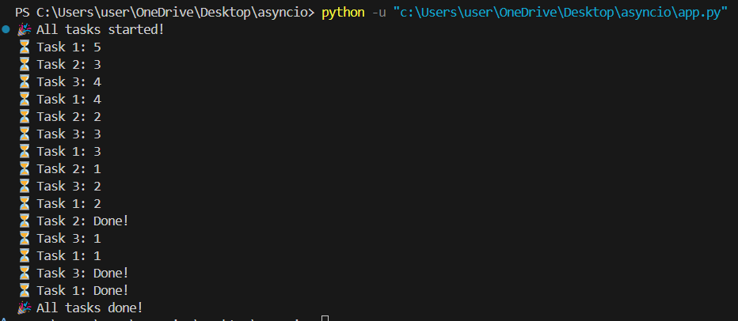
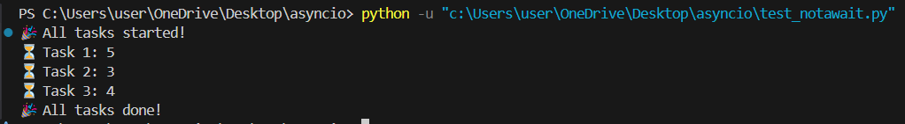
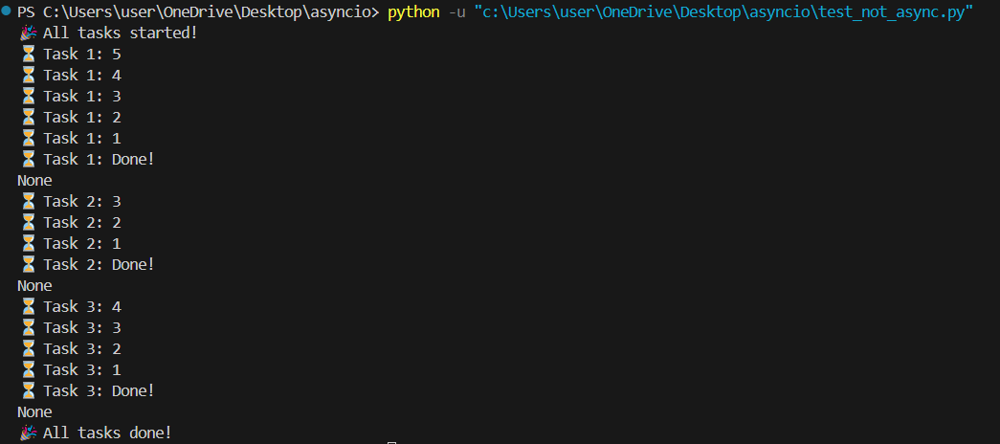

# Asyncio counter
> ***แสดงการทำงานของ asyncio ที่สามารถแบ่ง task ออกเป็นหลายๆ task และแต่ละ task ทำงานพร้อมกันได้***

## การทำงาน app.py
1. สร้าง async  function คือ count_down โดยจะรับ 2 ค่า คือ ชื่อ และ เวลาที่ต้องการนับถอยหลัง
2. ใน function จะเป็นการนับถอยหลังจากค่า n โดยจะจำลองว่าลดลงทีละ 1 โดยที่การลดลงนี้จะใช้เวลาครั้งละ 1 วินาที
3. สร้าง async function ขึ้นมาเพื่อเรียกใช้งาน โดยจะแบ่งการเรียกใช้งานเป็น task ละ 1 การเรียก และใช้ asyncio.create_task สร้าง task เพื่อจำลองการทำสามงานพร้อมกัน โดยที่ใช้ await เพื่อรอให้ task แต่ละ task ทำงานให้เสร็จก่อน จากนั้นจึงค่อยทำต่อ

## ผลลัพธ์การทำงาน app.py
จะเห็นได้ว่า task แต่ละ task สามารถทำงานพร้อมกันได้ โดยที่ทำงานพร้อมกันทั้ง 3 task และรอผลลัพธ์ของการทำงานครั้งนั้นก่อนจากนั้นจึงทำงานต่อจนครบ

## แล้วถ้าไม่ใช้ await หล่ะ? (test_notawait.py)
จะเห็นได้ว่าโปรแกรมทำงานเสร็จแล้ว แต่ task ยังทำงานไม่เสร็จ

## แล้วถ้าไม่ใช้ asyncio หล่ะ? (test_notasync.py)
จะเห็นได้ว่า โปรแกรมจะเริ่มทำ task ที่ 1 และรอจนกว่า task ที่ 1 จะเสร็จก่อนจากนั้นค่อยทำ task ต่อไป ทำให้เสียเวลา เพราะหากใช้ asyncio ก็จะทำให้ task อื่นๆไม่ต้องรอ task ก่อนหน้าและทำงานพร้อมกันและได้ผลลัพธ์โดยที่ใช้เวลาน้อยกว่า
